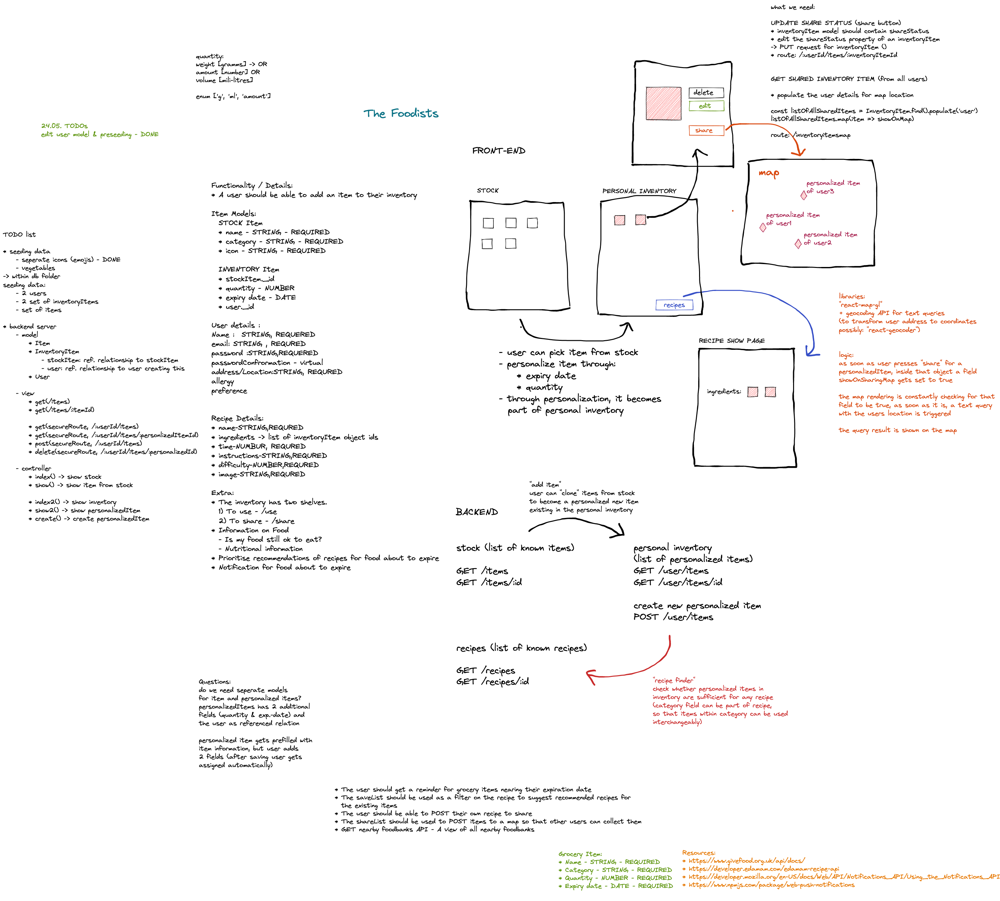
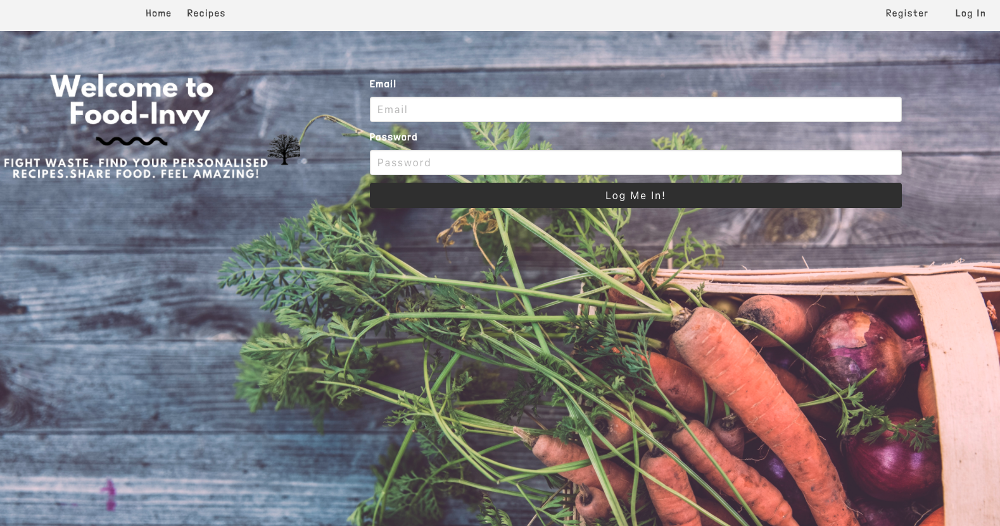
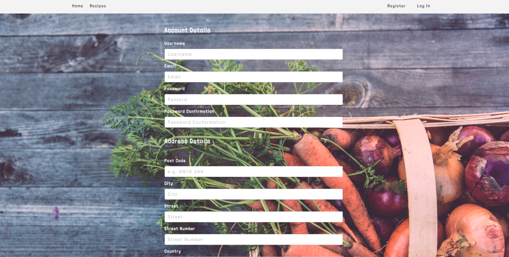
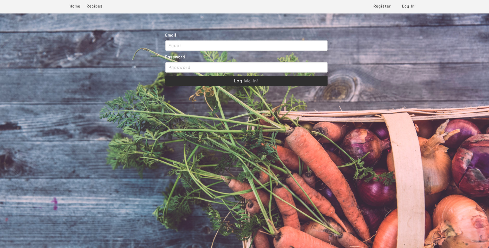

###  General Assembly, Software Engineering Immersive

# Food-Invy A Fullstack MERN App


## Overview

An app that keeps track of users' food inventory by monitoring expiry date, quantity and additional options to share food with other people.

This project has been developed during General Assembly course, with the goal of design a full-stack MERN app using over 10 days time.


## Members 

- Abubakar Siddique - [GitHub](https://github.com/AbuBakr-S)

- Jonas Bolduan  [GitHub](https://github.com/jonasbee)

- Dimitar Tsonev - [GitHub](https://github.com/D-Tsonev)

## Deployment

- Please follow the [link](https://foodinvy.netlify.app/) to visit the App deployed with Netlify and Heroku.

- Feel free to register your account, or you can use mine:

- Username: `dimi@dimi.com`

- Password: `dimi`

- [Repository link Client](https://github.com/D-Tsonev/project-3-client)

- [Repository link Server](https://github.com/D-Tsonev/project-3-server)

## The Brief 

- One week to plan, build, and test our most advanced project to date with achievable scope and a focus on creating a professional finished product.
- Make it a full-stack application by making our backend and frontend.
- Use an Express API to serve our data from a Mongo database.
- Consume our API with a separate frontend built with React.
- Be a complete product with multiple relationships and CRUD functionality for multiple models.
- Implement thoughtful user stories/wireframes for MVP and additional features.
- Have a visually impressive design.


## Technologies Used
* **Backend**:
  * MongoDB
  * Node.js
  * Express
* **Frontend**:
  * JavaScript (ES6)
  * React.js
  * HTML5
  * CSS3 + SASS
  * Bulma
* **Dependencies**:
  * Axios
  * React-router-dom
  * React-select
  * JSONWebToken
  * Bcrypt
  * mongoose-unique-validator
* **Development Tools**:
  * VS Code
  * Git + GitHub
  * Mapbox
  * Heroku
  * Excalidraw - White boarding
  * Zoom
* **External API**:
  * Mapbox

## Installation Instructions

1. Clone repo code from GitHub onto your machine.
2. Use `yarn` or `npm` to install all dependencies from the `package.json` file.
3. Start server: <code>yarn start</code>/<code>npm start</code>

## General Approach & Planning

Three of us worked together to plan out our Minimum Viable Poduct and used Excalidraw for white boarding.

We divided up the tasks needed to set up the backend and took turns writing seed data to populate the site.

Our backend was done in the first three days of the project and then moved on to assigning React components for each of us to do.

## Whiteboarding 



# Backend

We started by setting up much of the boilerplate backend views/controllers and models together. 

## Models

We eventually created models for the User, to enable registration and login.Also models for the items themselves as well as the user's inventory items and recipes.

- User

```js 

const userSchema = new mongoose.Schema({
  username: { type: String, required: true, unique: true },
  email: { type: String, required: true, unique: true },
  password: { type: String, required: true, hide: true },
  postalCode: { type: String, required: true },
  city: { type: String, required: true },
  street: { type: String, required: true },
  streetNo: { type: String, required: true },
  country: { type: String, required: true },
  coordinates: {
    type: [String], 
    required: true,
    validate: [
      { validator: (types) => (types.length === 2) }
    ],
  },
  preference: { 
    type: String, 
    required: false, 
    enum: {
      values: ['vegetarian', 'vegan', 'pescetarian'],
      message: '{VALUE} is not supported',
    },
  },
})

```
- Item

```js 
const itemSchema = new mongoose.Schema({
  name: { type: String, required: true },
  category: { type: String, required: true },
  icon: { type: String, required: true },
})
```

- Recipe

```js 
const recipeSchema = new mongoose.Schema({
  name: { type: String, required: true },
  timeRequired: { type: String, required: true },
  serves: { type: String, required: true },
  instructionSteps: { type: [String], required: true },
  difficulty: { type: String, required: true },
  image: { type: String, required: true },
  ingredients: [recipeItem],
  preference: { type: String, required: false },
})
```


- Inventory Item -  Embeded reference data 

```js

const InventoryItemSchema = new mongoose.Schema({
  item: { type: mongoose.Schema.ObjectId, ref: 'Item', required: true },
  quantity: { 
    type: Number, 
    required: true,
    validate: [
      { validator: (type) => (type > 0) }
    ], 
  },
  expiryDate: { 
    type: Date, 
    required: true,
  },
  user: { type: mongoose.Schema.ObjectId, ref: 'User', required: true },
  isShared: {
    type: Boolean,
    default: false,
    required: false,
  },
})

```

## Controllers

I was wornking on InvenotryItem controllers.
The trickies part was attaching user to the item and showing this later on as personal items inventory.

 ```js 
async function create(req, res, next) {
  // ? attach user to item
  req.body.user = req.currentUser
  // ? attach item to inventoryItem
  const item = await Item.findById(req.params.itemId)
  req.body.item = item
  try {
    const newInventoryItem = await InventoryItem.create(req.body)
    res.status(201).json(newInventoryItem)
  } catch (error) {
    next(error)
  }
}

```

We created recipe generator(finder), looping through array of inventory items(ingredients) and returning recipe suggestion if the user have all ingreadincs needed in his inventory.

```js 

async function checkForRecipe(req, res, next) {
  try {
    const currentUserId = req.currentUser._id
    const inventoryItemList = await InventoryItem.find({ user: `${currentUserId}` }).populate('item')
    const recipeList = await Recipe.find()
    let foundPotentialRecipe
    const listOfFoundRecipes = recipeList.filter(recipe => {
      for (let index = 0; index < recipe.ingredients.length; index++) {
        if (
          (inventoryItemList.find(inventoryItem => inventoryItem.item.name.toLowerCase() === recipe.ingredients[index].name.toLowerCase())) === undefined
        ) {
          foundPotentialRecipe = false
          break
        } else {
          foundPotentialRecipe = true
        }
      }
      return foundPotentialRecipe

    })
```
Once all the models were in place, me and another member of the team were tasked with seeding data for the database and adding them using Javascript Object notation which would then be stored as a JSON document on our MongoDB database.


# Frontend

After seeding the data, we were ready to move onto the React frontend. 
While my group worked on the recipe, inventory and the shared food pages I took on the opportunity to build out the register, login and home pages together with the nav bar, a crucial aspect to catch the eye of our users when they land on the site.


- Home Page 





- Register and Login Page 


  


React Hooks were used for both forms.


```js 

export function useForm(initialFormdata) {
  const [formdata, setFormdata] = React.useState(initialFormdata)
  const [formErrors, setFormErrors] = React.useState(initialFormdata)

  const handleChange = e => {
    setFormdata({ ...formdata, [e.target.name]: e.target.value })
    setFormErrors({ ...formErrors, [e.target.name]: '' })
  }

  return {
    formdata,
    formErrors,
    handleChange,
    setFormErrors,
    setFormdata,
  }
}
```

- Login page 


```js
function Login () {
  const history = useHistory()
  const [isError, setIsError] = React.useState(false)
  const { formdata, handleChange } = useForm({
    email: '',
    password: '',
  })

  const handleSubmit = async (e) => {
    e.preventDefault()

    try {
      const res = await login(formdata)
      setToken(res.data.token)
      history.push('/items')
    } catch (err) {
      setIsError(true)
    }
  }

  const handleFocus = () => {
    setIsError(false)
  }

```

- Register Page 

```js 
function Register() {
  const history = useHistory()
  const { formdata, formErrors, handleChange, setFormErrors } = useForm({
    username: '',
    email: '',
    password: '',
    passwordConfirmation: '',
    postalCode: '',
    city: '',
    street: '',
    streetNo: '',
    country: '',
    preference: '',
    coordinates: '',
  })
  
  const handleSubmit = async (e) => {
    e.preventDefault()

    try {
      await register(formdata)
      history.push('/login')
    } catch (err) {

      setFormErrors(err.response.data.errors)
  ```

# Challenges

This has been the first project I built in a team, using Git and Github.

As well this has been the first time working on top of a code wrote by someone else.

One of our biggest challenges has been embedded data and authorization token.

Overall I enjoyed working on this project and working in well organized team.


## Future Features

- Create a Notification feature for expiring food.

## Key Learning

This project told me a lot, especially about teamwork while coding.
Overall I learned more doing this project than I had ever done before, it was by far the largest and most complicated project I have ever undertaken.

One of the most crucial aspects I learnt from this project was the planning. To my disadvantage, I hadn't spent too much time planning on Projects 1 & 2 but here we made a concerted effort not to begin with any coding until we were happy with our plan.

One aspect I think our group could have improved on was asking each other for help sooner. Occasionally we would spend too long on a task without asking for help, losing valuable time, when a group member could have helped out with added knowledge.


